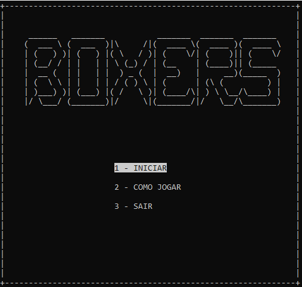
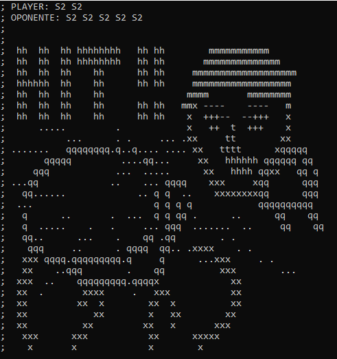
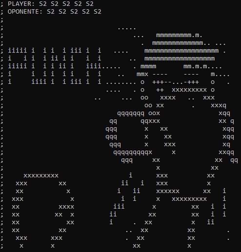

# 🥊 BOXERS  
Um jogo de luta 2D desenvolvido em C, simples e direto, com interface em ASCII no terminal.

---

## 📌 SOBRE O PROJETO  
O projeto visa criar um jogo simplificado, utilizando a linguagem C para simular uma luta de boxe, para melhor experiência do
usuário utilizamos uma biblioteca famosa para lidar com as atualizações do terminal, **ncurses**, desenvolvida nos anos 80 e
posteriormente aprimorada nos anos 90, é amplamente utilizada para deixar o terminal mais intuitivo, permite inputs diretos
do usuario, cores, atualizações na tela, desenho, etc... Para nosso projeto, ela lida com os sprites sendo alterados
dinamicamente dando um senso de movimento, e também lê as teclas pressionadas do teclado enquanto o jogo roda,
a partir do momento que a luta começa, se o jogador não pressionar as teclas de defesa ou ataque, o programa continuará
rodando até a vida do jogador chegar a zero.

---

## 🔧 REQUISITOS  
- Sistema **Linux**  
- Biblioteca **ncurses**  

---

## 🎯 OBJETIVO  
Uma vez compilado, seu terminal se tornará o ambiente da luta!  
Com comandos básicos e uma jogabilidade desafiadora, você enfrentará um adversário feroz.  
⚠️ **Use a defesa com sabedoria... ou será nocauteado!**  

---

## 📥 COMO INSTALAR  
### Arch
```
sudo pacman -S ncurses
git clone https://github.com/alberthydev/jogo-paradigmas.git
cd jogo-paradigmas
gcc main.c -o boxers -lncurses
```

### Ubuntu/Debian
```
sudo apt update
sudo apt install libncurses-dev
git clone https://github.com/alberthydev/jogo-paradigmas.git
cd jogo-paradigmas
gcc main.c -o boxers -lncurses
```

### Fedora
```
sudo dnf install ncurses-devel
git clone https://github.com/alberthydev/jogo-paradigmas.git
cd jogo-paradigmas
gcc main.c -o boxers -lncurses
```

### openSUSE
```
sudo zypper install ncurses-devel
git clone https://github.com/alberthydev/jogo-paradigmas.git
cd jogo-paradigmas
gcc main.c -o boxers -lncurses
```
---

## ▶️ Executando o jogo
Entre na pasta do projeto
```
cd jogo-paradigmas
```
Para executar o projeto, depois de compilado, digite o seguinte comando:
```
./boxers
```

---

## 🛠️ FERRAMENTAS UTILIZADAS  
- NCurses
- GCC

---

## 🎮 NAVEGAÇÃO  
Ao abrir o **menu**, use as teclas **⬆️ (Seta para cima) e ⬇️ (Seta para baixo)** para navegar e **ENTER** para confirmar.  

📌 **Opções do menu:**  
- `[1]` - **INICIAR** → Começa uma luta  
- `[2]` - **COMO JOGAR** → Exibe as instruções  
- `[3]` - **SAIR** → Fecha o jogo  

---

## 🕹️ COMO JOGAR  
Durante a luta, utilize os seguintes comandos:  
- **1** → 🥊 Soco no adversário  
- **2** → 🛡️ Defesa contra o ataque do adversário  
- **Q** → ❌ Sair da partida  

---

## 🤝 CONTRIBUIÇÃO/DESENVOLVIMENTO  

### 📝 COMO CONTRIBUIR  
Se deseja implementar alguma feature nova, basta desenvolver e dar um pull request que vamos avalia-lo e permiti-lo!

### 🐛 RELATAR PROBLEMA  
Se encontrou algum bug, abra uma issue [aqui](https://github.com/alberthydev/jogo-paradigmas/issues). 

---

## 🎨 LOCAL PARA DESENHAR EM ASCII  
🎭 Se quiser criar novos designs em ASCII, use:  
[ASCII FLOW](https://asciiflow.com/#/)  

---

## 🖼️ SCREENSHOTS
<div style="display: flex; justify-content: center;">
    
    
    
</div>
